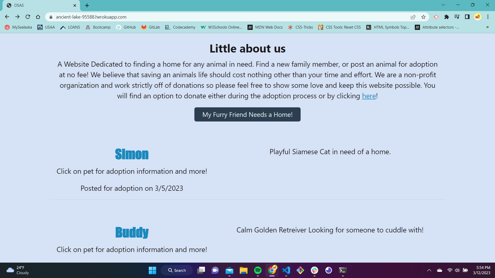
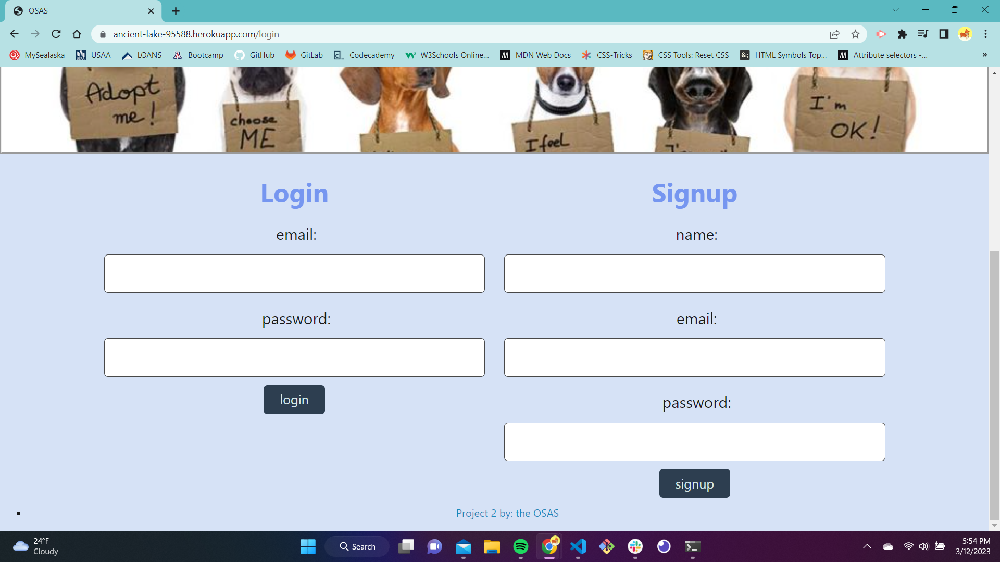
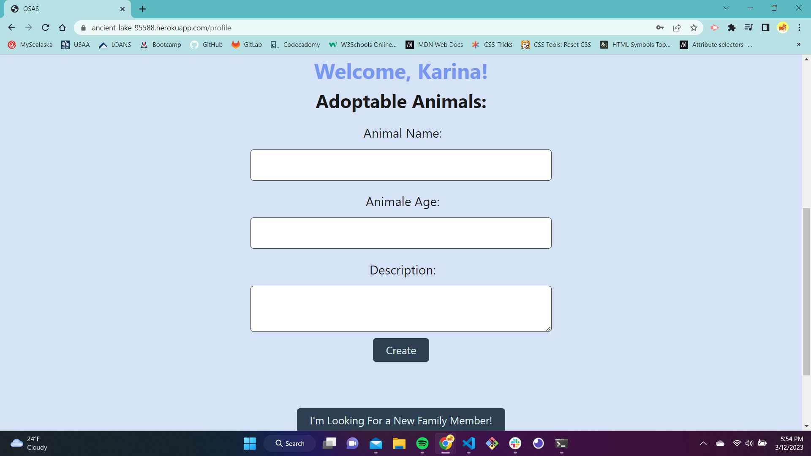

# One Stop Adopt Shop 
[Deployed View](https://ancient-lake-95588.herokuapp.com/) 
<br>

The purpose of this application is to find adoptable animals for your choosing and/or to surrender your current pet you can no longer care for.

<br>

## Table of Contents

1. [Technology Used](#technology-used)
2. [Installations](#installations)
3. [Usage](#usage)
4. [Photos](#photos)


<br>

## Technology Used:

- HTML
- CSS
- JavaScript
- MySQL
- Node.js
- Express.js
- Handlebars.js

<br>

## Installations
Use the NPM - Node Package Manager installation:
```bash
npm i
```
To initialize:
```bash
npm init
```
To create seed file:
```bash
npm run seed
```

<br>

## Usage
To invoke the application run the following command:
```bash
npm start
```

<br>

## Photos


Homepage: Where the posting of the available animals are located


Available to log in or sign up with us


Fill out the questionaire and that pet will be available for adoption


<br><br>

## Team OSAS
- Kyle Schoppmann
- Joshua Muniz
- Karina Morrison
- Nikhil Prince 
- Izaak Villa

